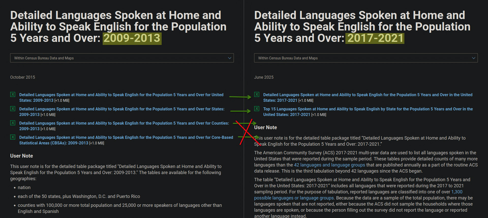

I was going through [this website](https://probablyhelpful.com/languages/Japanese.html), enjoying the ACS data. However, the data was over a decade old, so I sought out the updated data.  
I ended up finding out that the dataset had regressed **a lot** in its latest release.  
<https://www.census.gov/topics/population/language-use/data.html>  
The dataset is not particularly useful for any regional or state level analysis.  
The data may have **some** utility for those languages not captured in the [designated 42 languages](https://www.census.gov/topics/population/language-use/about.html)  

--------------------

So if you're interested in Language Use Data the correct place to get such data is not through `Census.gov / Topics / Population / Data`  
Instead you have to manually retrieve the data through <https://data.census.gov/>. Albeit it has to be one of the designated 42 languages.   
Within the ACS data the table I went with was `B16001`.    

### The Changes  

  
  
::: {.column-margin}
Language Caps over 10k:  

|State|15th Language Group Size|  
|-|------|  
|California       |133,200  |  
|New York         |62,460   |  
|Texas            |37,580   |  
|New Jersey       |36,050   |  
|Illinois         |25,270   |  
|Florida          |21,970   |  
|Massachusetts    |20,570   |     
|Pennsylvania     |18,280   |  
|Washington       |16,860   |  
|Virginia         |15,870   |  
|Maryland         |14,450   |  
|Georgia          |14,410   |  
|Michigan         |14,250   |  
|Ohio             |10,110   |  
|North Carolina   |9,975    |  
: {.striped .sm}    
:::  

Not only is there a loss of the county level data & CBSA (Core Based Statistical Areas; ie Metro Areas). But the remaining State data is limited to the top 15 languages with speakers.  

Fifteen may sound like a lot, but for larger states it can end up erasing fairly large groups of speakers. This issue particularly impacts states with more diverse speakers like New York.  

This restriction creates a "language cap", below which a language group is not counted.  

The only languages to have full 50 state coverage are Spanish and Chinese!  

### The Actual Data  

As stated at the start it's necessary to find and filter through the data from  
<https://data.census.gov/>  

The table I went for was `B16001`. Selecting the recent 5-year ACS dataset, then transposing and restricting to the language of interest.  

The ACS question:  
{.lightbox width=300}

full questionnare: <https://www.census.gov/programs-surveys/acs/about/forms-and-instructions.html>

