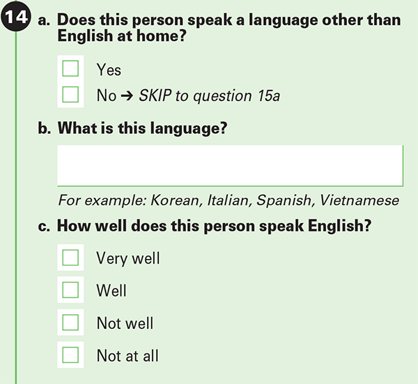

I needed some language data, so I ended up making something similar to this site: <https://probablyhelpful.com/languages/Japanese.html>.  Except with newer data, more visualizations, searchable tables, and some helpful statistics.  

### Why  
There are a number of factors unique to Japanese that create upward wage pressure for bilingual speakers (me).  
From the demand side:  

1. Japan is and has been the country with the most direct investment in the US. [src1](https://www.jetro.go.jp/usa/japan-us-investment-report/), [src2](https://apps.bea.gov/iTable/?ReqID=2&step=1)  
2. Japan is the fourth largest economy (investment target) [src3](https://en.wikipedia.org/wiki/List_of_countries_by_GDP_%28nominal%29), fifth when adjusting for PPP [src4](https://en.wikipedia.org/wiki/List_of_countries_by_GDP_(PPP))  

On the supply side:  

1. Japan ranks poorly in the "English Proficiency Index". [src5](https://en.wikipedia.org/wiki/EF_English_Proficiency_Index)  
2. Japanese is among the hardest language to learn for English speakers (along with Arabic, Chinese, Korean). [src6](https://blog.rosettastone.com/the-complete-list-of-language-difficulty-rankings/)  
3. Japan has a small emigrant population relative to its population size. [src7 (Source available through wayback machine)](https://en.wikipedia.org/wiki/List_of_sovereign_states_by_immigrant_and_emigrant_population#Emigrant_population)  
4. Regional concentrations/disparities within the US (the purpose of this analysis). [src8=myself+ACS data](./jpacsdata.qmd#tables-visuals-表見える化)  

Together, these factors make Japanese a uniquely valuable language in the US. China/Chinese is similar in some respects, but lacks, basically any, direct investments into the US. For reference, in 2025 Austria had more direct investment into the US than China.   

As an aside, I wish the BLS would release language specific data on Interpreters and Translators. Rather than the general translator bucket. (How am I supposed to interpret the wage data!)  
There is also the complication of specializations that require language ability as an addition, but are not a "translator" role. With the right data I imagine they could create an average % wage premium that a language adds.  
An [example](https://www.econstor.eu/bitstream/10419/182280/1/GLO-DP-0251.pdf) wherein they identified the wage premium a foreign language skill provided (in Poland).  

### Data  

:::{.column-margin}  
The ACS question:  
{.lightbox}  
:::  

The data originates from <https://data.census.gov/>.  

U.S. Census Bureau. "Language Spoken at Home by Ability to Speak English for the Population 5 Years and Over." American Community Survey, ACS 5-Year Estimates Detailed Tables, Table B16001.  

full questionnare: <https://www.census.gov/programs-surveys/acs/about/forms-and-instructions.html>  

Potential issues with the data to be concious of:  

* The errors are based on a 90% confidence interval.  
* ACS data is not a census and may have non-sampling error.  
* Data is for all age groups when one might only be interested in those of working age (18-64) my best estimate puts it at ~60%.  
  + This 60% figure can also invite scrutiny. Explained further below.  
* The bilingual statistic is based on those who responded as speaking english "very well", excluding those who selected as speaking "well" or below.  
* Individuals who know the language may interpret "speak language ***at home***" more strictly and not respond with the language spoken.  ie. A language learner w/o someone to speak w/ at home.  
* Speaking at home is used as a proxy to fluency, but such fluency may be considered insufficient by other standards. (尊敬語 or reading/writing skills come to mind)  


### Observations  
Alaska, Utah, Nevada stood out as locations not traditionally associated with a Japanese diaspora, but had **relatively** high populations of Japanese speakers.  
Racially/ethnically Hawaii has a much higher Japanese population, but when it comes to language speakers Hawaii is on par with New York. (Lower if you include New Jersey due to proximity)  
Florida and Texas have a low proportion of Japanese speakers, but make up for it by sheer size.  

### Tables & Visuals 表・見える化
:::{.column-page-right}  

::: {.panel-tabset}  

## Nominal / Proportional
```{python}
import pandas as pd
import geopandas as gpd
import folium
import itables
import geoplot

jpmap = gpd.read_file("../../census/jpmap.gpkg")

itables.show(pd.DataFrame(jpmap.loc[:,["state","population","epopulation","eng","eeng","jpn","ejpn","nomjpnrank","bilingual","ebilingual",
                            "nombilingualrank","jpnloweng","ejpnloweng"]]), 
                            maxBytes=200000, style="width:100%", 
                            buttons=["pageLength", {"extend": "colvisGroup","text": "Hide Errors","hide": [2,4,6,9,12]},
                                                    {"extend": "colvisGroup","text": "Show all","show": "*"}],
                            columnDefs=[{"className":"dt-left", "targets":[0]}, 
                                        {"targets":[2,4,6,9,12], "visible":False}],
                            columnControl=["order"],
                            ordering={"indicators": False, "handler": False})

itables.show(pd.DataFrame(jpmap.loc[:,["state","population","jpn","percentjpn","jpnrank","percentbilingual","bilingualrank"]]), 
                            maxBytes=200000, style="width:100%", buttons=["pageLength"],
                            columnDefs=[{"className":"dt-left", "targets":[0]}],
                            columnControl=["order"],
                            ordering={"indicators": False, "handler": False})
```  

## Map

:::{html}
<style>
  .under-construction {
    display: flex;
    align-items: center;
    justify-content: center;
    gap: 12px;
    background: #ffff00;
    color: #000;
    border: 4px dashed #ff0000;
    padding: 8px;
    margin: 10px 0;
    font-weight: bold;
    font-size: 15px;
  }
  .spin {
    display: inline-block;
    animation: spin 2s linear infinite;
    font-size: 28px;
  }
  @keyframes spin {
    from { transform: rotate(0deg); }
    to { transform: rotate(360deg); }
  }
</style>
<span class="under-construction"><span class="spin">🚧</span> UNDER CONSTRUCTION <span class="spin">🚧</span></span>
:::   
Borrowed from <https://llm2human.pages.dev/>  

## Regional  
```{python}
regionallang = jpmap.loc[:,["population","eng","jpn","bilingual","jpnloweng","region"]].groupby(["region"], as_index=False).sum()
regionallang["percentjpn"] = (regionallang.jpn * 100) / regionallang.population
regionallang["percentbilingual"] = (regionallang.bilingual * 100) / regionallang.population
itables.show(regionallang, maxBytes=200000, style="width:100%",
                            columnDefs=[{"className":"dt-left", "targets":[0]}],
                            columnControl=["order"],
                            ordering={"indicators": False, "handler": False})
```  

## Metro Areas

:::{html}
<style>
  .under-construction {
    display: flex;
    align-items: center;
    justify-content: center;
    gap: 12px;
    background: #ffff00;
    color: #000;
    border: 4px dashed #ff0000;
    padding: 8px;
    margin: 10px 0;
    font-weight: bold;
    font-size: 15px;
  }
  .spin {
    display: inline-block;
    animation: spin 2s linear infinite;
    font-size: 28px;
  }
  @keyframes spin {
    from { transform: rotate(0deg); }
    to { transform: rotate(360deg); }
  }
</style>
<span class="under-construction"><span class="spin">🚧</span> UNDER CONSTRUCTION <span class="spin">🚧</span></span>
:::  
Borrowed from <https://llm2human.pages.dev/>  

:::  

:::  


:::{.column-page-right}  

### Other Stats

The data does not provide information on age (we might be interested in working age pop).  
Below is my best estimate at a working age population correction factor.  

::: {.list-table aligns="r,l"}
- - 203,771,037 / 316,142,548 = 64.5%     
  - of the general populace is working age (18 to 64)  
- - 330,000 * 67% ~= 220,000  
  - Working age JPN immigrants  
- - 1,060,000 * 58% ~= 615,000  
  - Working age native born JPN-Americans  
- - (220,000 + 615,000) / 1,390,000 * 58% ~= 60%  
  - Estimate for working age population among JPN in the US.  
- - []{colspan=2} [pew fact sheet using ~2021-2023 ACS data](https://www.pewresearch.org/race-and-ethnicity/fact-sheet/asian-americans-japanese-in-the-u-s/)  

:::  
One issue with this estimate is the use of race/ethnicity instead of language ability. But the language ability/age dataset is grouped up into the larger group of API (Asia/Pacific Islander). This is problematic due to the sheer size and diversity of individuals coming from Asia (Japanese immigrants are but a small fraction of that).  
:::
