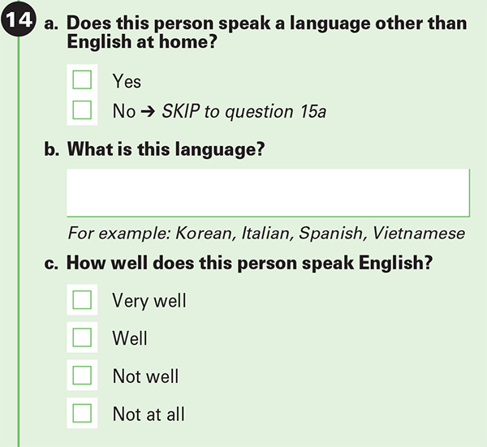

[英語版 English Version](./jpacsdata.qmd)  

<style>
  .under-construction {
    display: flex;
    align-items: center;
    justify-content: center;
    gap: 12px;
    background: #ffff00;
    color: #000;
    border: 4px dashed #ff0000;
    padding: 8px;
    margin: 10px 0;
    font-weight: bold;
    font-size: 15px;
  }
  .spin {
    display: inline-block;
    animation: spin 2s linear infinite;
    font-size: 28px;
  }
  @keyframes spin {
    from { transform: rotate(0deg); }
    to { transform: rotate(360deg); }
  }
</style>
<span class="under-construction"><span class="spin">🚧</span> 工事中 <span class="spin">🚧</span></span>


### なぜ  
  
There are a number of factors unique to Japanese that create upward wage pressure for bilingual speakers.  
  
需要側からは：  

1. 日本は米国に対する対外直接投資が最も多い国。[1](https://www.jetro.go.jp/usa/japan-us-investment-report/), [2](https://apps.bea.gov/iTable/?ReqID=2&step=1)  
2. GDP統計で日本は第4位(投資対象国), 購買力平価(PPP)調整では第5位[3](https://en.wikipedia.org/wiki/List_of_countries_by_GDP_%28nominal%29) [4](https://en.wikipedia.org/wiki/List_of_countries_by_GDP_(PPP))  

供給側からは：  

1. 日本は(EF英語習熟度指数)で低い順位 [5](https://en.wikipedia.org/wiki/EF_English_Proficiency_Index)  
2. 日本語は他の言語より、英語との違いが多い。アラブ語、中国語、韓国語とともにもっとも習得が難しい言語と言われてます。[6](https://blog.rosettastone.com/the-complete-list-of-language-difficulty-rankings/)  
3. 他の国と比べると日本から移住する人数は少ない（均等割り） [7](https://en.wikipedia.org/wiki/List_of_sovereign_states_by_immigrant_and_emigrant_population#Emigrant_population)  
4. 米国内の地域による集積や不均衡 [8](./jpacsdata.qmd#tables-visuals-表見える化)  

### データ  

:::{.column-margin}  
ACS(調査)の問題:  
{.lightbox}  
:::  

<https://data.census.gov/>からのデータ  
　 
参考文献:  
U.S. Census Bureau. "Language Spoken at Home by Ability to Speak English for the Population 5 Years and Over." American Community Survey, ACS 5-Year Estimates Detailed Tables, Table B16001.  

調査の全体: <https://www.census.gov/programs-surveys/acs/about/forms-and-instructions.html>  

データに注意する問題点:  

* The errors are based on a 90% confidence interval.  
* ACS data is not a census and may suffer from non-sampling error.  
* Data is for all age groups when one might only be interested in those of working age (18-64) my best estimate puts it at ~60%.    
* The bilingual statistic is based on those who responded as speaking english "very well", excluding those who selected as speaking "well" or below.  
* Individuals who know the language may interpret "speak language ***at home***" more strictly and not respond with the language spoken.  ie. A language learner w/o someone to speak w/ at home.  
* Speaking at home is used as a proxy to fluency, but such fluency may be considered insufficient by other standards. (尊敬語 or reading/writing skills come to mind)  


### Observations  
Hawaii has the highest proportion of Japanese, but due to size Hawaii actually has fewer bilingual speakers than the NYC metro area (20552 Bilingual speakers in Hawaii; 23268 Bilingual speakers in NY-NJ metro area).  

Alaska, Utah, Nevada stood out as locations not traditionally associated with a Japanese diaspora, but had **relatively** high populations of Japanese speakers.  

Florida and Texas have a low proportion of Japanese speakers, but make up for it by sheer size.  


### 表・見える化
:::{.column-page-right}  

::: {.panel-tabset}  

## Nominal / Proportional
```{python}
import pandas as pd
import geopandas as gpd
import numpy as np
import folium
import itables
import geoplot
import mapclassify as mc
import geoplot.crs as gcrs
import matplotlib

jpmap = gpd.read_file("../../census/jpmap.gpkg")
itables.options.css = """
.dt-column-header {
  font-size: small;
}
"""
jtable = jpmap.loc[:,["ST","state","population","epopulation","eng","eeng","jpn","ejpn","bilingual","ebilingual",
                            "jpnloweng","ejpnloweng","pctjpn","pctbilingual","bilingualratio"]]
jtable.columns = ["州(略)","州","人工","人工(誤差)","英語人","英語人(誤差)","日本語人","日本語人(誤差)","日英バイリン","日英バイリン(誤差)", 
                            "英下手","英下手(誤差)","日本語比率","バイリン比率","バイリン割り"]
itables.show(pd.DataFrame(jtable), 
                            maxBytes=200000, style="width:100%", 
                            buttons=["pageLength", {"extend": "colvisGroup","text": "誤差を隠す","hide": [0,3,5,7,9,11]},
                                                    {"extend": "colvisGroup","text": "全体","show": "*"}],
                            columnDefs=[{"className":"dt-left", "targets":[0,1]}, 
                                        {"targets":[0,3,5,7,9,11], "visible":False}],
                            columnControl=["order"],
                            ordering={"indicators": False, "handler": False})

```  

## Map

```{python}
m = folium.Map(location=[35.3, -97.6], zoom_start=4)

for idx, row in jpmap.iterrows():
    popup_html = f"""
    <style>
        .leaflet-popup-content-wrapper,
        .leaflet-popup-content {{
            min-width: 300px !important;
            max-width: 400px !important;
        }}
        table {{
            table-layout: fixed;
            width: 100%;
            border-collapse: collapse;
        }}
        th, td {{
            font-size:12px;
            border: 1px solid black;
            padding: 6px 8px;
            white-space: nowrap;
            overflow: hidden;
            text-overflow: ellipsis;
        }}
        th {{background-color: #f5f5f5; font-weight: bold;}}
    </style>
    <table>
        <colgroup>
            <col style="width: 65%">
            <col style="width: 35%">
        </colgroup>
        <tr>
            <th colspan="2" style="font-weight:bold;">{row['ST']} - {row['state'].title()}</th>
        </tr>
        <tr>
            <th>人工</th>
            <td>{row['population']:,}</td>
        </tr>
        <tr>
            <th>日米バイリンガル人工位(公称)</th>
            <td>{row['nombilingualrank']} (x̄ = {row['bilingual']:,})</td>
        </tr>
        <tr>
            <th>日米バイリンガル位(均等割り)</th>
            <td>{row['bilingualrank']} ({row['pctbilingual']:.4f}%)</td>
        </tr>
        <tr>
            <th>日本語人位(公称)</th>
            <td>{row['nomjpnrank']} (x̄ = {row['jpn']:,})</td>
        </tr>
        <tr>
            <th>日米バイリンガル割り</th>
            <td>{row['bilingualratio']:.4f}</td>
        </tr>
    </table>
    """
    bins = mc.FisherJenks(jpmap["bilingual"], k=6).bins.astype(int)
    cmap = matplotlib.colormaps.get_cmap("seismic")
    gradient = np.linspace(0, 1, 6)
    colors = [matplotlib.colors.to_hex(cmap(i)) for i in gradient]
    fcolor = colors[np.digitize(row["bilingual"]*.99999,bins)]
    folium.GeoJson(
        row.geometry,
        style_function=lambda x, fc=fcolor: {"fillColor": fc, "fillOpacity":"65%","color":"white"},
        tooltip=f"{row.state.title()}",
        popup=folium.Popup(popup_html)
    ).add_to(m)

legend_html = """
<div style="position:fixed; bottom:40px; left:50px; width:240px; background:rgba(255,255,255,0.8); 
            padding:12px 14px; border:2px solid #666; border-radius:6px; z-index:999; 
            box-shadow: 2px 2px 6px rgba(0,0,0,0.2); color:black;text-align:center;">
    <div style="font-weight:bold; font-size:15px; margin-bottom:5px;">
        日米バイリンガル人工</div>
    <div style="height:14px; background:linear-gradient(to right,#00004c 0%,#0000db 20%,#9999ff 40%,#ff9999 60%,#e60000 80%,#800000 100%); 
                border-radius:3px; margin-bottom:6px;"></div>
    <div style="font-size:12px; text-align:center;">
        少ない &nbsp;&nbsp;&nbsp;&nbsp;&nbsp;&nbsp; ⇒ &nbsp;&nbsp;&nbsp;&nbsp;&nbsp;&nbsp; 多い</div></div>
"""
m.get_root().html.add_child(folium.Element(legend_html))
m
```  
---  
Cartogram を試してみた.  

アラスカとハワイを除いた日米バイリンガル人工(公称)  

```{python}
dc48 = jpmap[~jpmap.state.isin(["alaska", "hawaii"])]
scheme = mc.FisherJenks(dc48["bilingual"], k=6)
nb = mc.FisherJenks(dc48["bilingual"], k=6).bins
scheme.bins = np.round(nb, decimals=3)
ax = geoplot.cartogram(
    dc48, scale="bilingual", projection=gcrs.AlbersEqualArea(),
    legend=True, legend_kwargs={'bbox_to_anchor': (0.22, 0.42)}, legend_var="hue",
    hue="bilingual", scheme=scheme, cmap="seismic"
)
ax.set_title("")
geoplot.polyplot(dc48, facecolor="lightgray", edgecolor="white", ax=ax)
```  
アラスカとハワイを除いた日米バイリンガル人工(均等割り；％)
```{python}
scheme = mc.FisherJenks(dc48["pctbilingual"], k=6)
nb = mc.FisherJenks(dc48["pctbilingual"], k=6).bins
scheme.bins = np.round(nb, decimals=3)
ax = geoplot.cartogram(
    dc48, scale="pctbilingual", projection=gcrs.AlbersEqualArea(),
    legend=True, legend_kwargs={'bbox_to_anchor': (0.22, 0.42)}, legend_var="hue",
    hue="pctbilingual", scheme=scheme, cmap="seismic"
)
ax.set_title("")
geoplot.polyplot(dc48, facecolor="lightgray", edgecolor="white", ax=ax)
```


## Regional  
```{python}

regionallang = jpmap.loc[:,["population","eng","jpn","bilingual","jpnloweng","region"]].groupby(["region"], as_index=False).sum()
regionallang["pctjpn"] = (regionallang.jpn * 100) / regionallang.population
regionallang["pctbilingual"] = (regionallang.bilingual * 100) / regionallang.population
regionallang.columns = ["地域","人工","英語人","日本語人","日英バイリン","英下手","日本語比率","バイリン比率"]
itables.show(regionallang, maxBytes=200000, style="width:100%",
                            columnDefs=[{"className":"dt-left", "targets":[0]}],
                            columnControl=["order"],
                            ordering={"indicators": False, "handler": False})
```  

## Metro Areas
```{python}
jpmetro = pd.read_csv("../../census/jpmetro.csv")


jmetro = jpmetro.loc[:,["metro-area","population","epopulation","eng","eeng","jpn","ejpn","bilingual","ebilingual","pctjpn","pctbilingual",
                        "bilingualratio"]]
jmetro.columns = ["都市圏","人工","人工(誤差)","英語人","英語人(誤差)","日本語人","日本語人(誤差)","日英バイリン","日英バイリン(誤差)","日本語比率","バイリン比率",
                        "バイリン割り"]

itables.show(pd.DataFrame(jmetro), 
                            maxBytes=200000, style="width:100%", 
                            buttons=["pageLength", {"extend": "colvisGroup","text": "誤差を隠す","hide": [2,4,6,8]},
                                                    {"extend": "colvisGroup","text": "全体","show": "*"}],
                            columnDefs=[{"className":"dt-left", "targets":[0]}, 
                                        {"targets":[2,4,6,8], "visible":False}],
                            columnControl=["order"],
                            ordering={"indicators": False, "handler": False,},
                            classes="display")
```  

:::  

:::  


:::{.column-page-right}  

### その他

年齢のデータは含めてありません（たとえ、生産年齢人工に興味あるかもしれない）。
下は頑張って見当した生産年齢補正数字。

::: {.list-table aligns="r,l"}
- - 203,771,037 / 316,142,548 = 64.5%     
  - 生産年齢人工 (18才から64才)  
- - 330,000 * 67% ~= 220,000  
  - 日本からの移住者(生産年齢)  
- - 1,060,000 * 58% ~= 615,000  
  - 米生まれの日系(生産年齢)  
- - (220,000 + 615,000) / 1,390,000 ~= 60%  
  - 日本語話者の生産年齢人工推計  
- - []{colspan=2} [pew fact sheet using ~2021-2023 ACS data](https://www.pewresearch.org/race-and-ethnicity/fact-sheet/asian-americans-japanese-in-the-u-s/)  

:::  
言語とともの年齢データが無いので、これは(日系)人種と年齢データを使って見当した推計。  

:::

