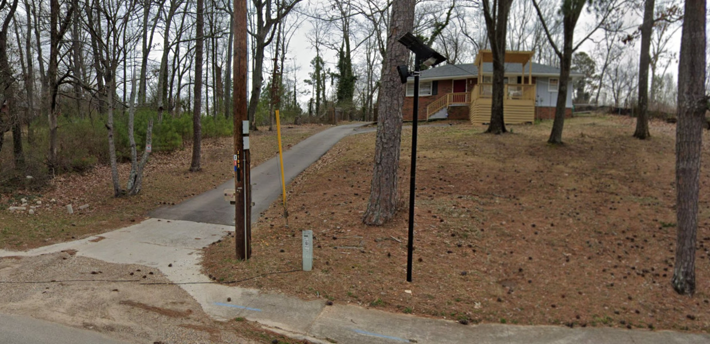
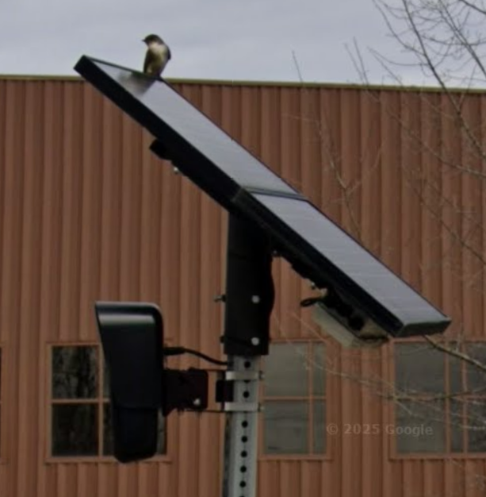
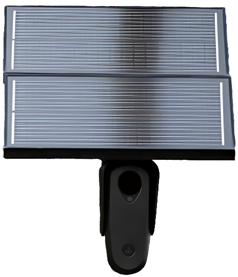

  

::: {.column-margin}
::: {.justify}
```{=html}
<div style="font-size:35px;color:#bebebe;margin:0 !important">
  DO NOT WORRY CITIZEN THIS IS FOR YOUR<span class="fake-span"></span><div style="position: relative; font-size: 2rem; font-family: monospace; text-align:center; background-color:#000000"><span id="swaptext" class="glitch"></span></div>
</div>
```
:::
:::

<!-- <p style="font-size:35px;transform:scaleX(1.5);">THIS IS <span class="redacted">NOT</span> NORMAL</p> -->
```{=html}
<div style="width:70%;" class="wrapper">
  <div>T</div>
  <div>H</div>
  <div>I</div>
  <div>S</div>
  <div>&nbsp;&ensp;</div>
  <div>I</div>
  <div>S</div>
  <div>&ensp;</div>
<div style="font-size:35px;display:flex;" class="redacted">NOT</div> <br>
</div>
<div class="wrapper">
  <div>N</div>
  <div>O</div>
  <div>R</div>
  <div>M</div>
  <div>A</div>
  <div>L</div>
</div>
```  

::: {.column-margin}
  
:::

----------  

::: {.justify}
```{=html}
<p style="font-size:35px">THE <span class="redacted">GOVERNMENT BIRDS</span>
REQUIRE A PLACE TO RECHARGE
<span class="fake-span"></span>  
</p>  
```  
:::
  

----------

    
::: {.column-margin}
```{=html}
<div class="container">
  <div class="HAL"></div>
  </div>
```
:::

Jokes aside.  
I made some tools you might find useful to counter the surveillance state.  

★'s demarcate usefulness (my opinion ; scale of 5)  


### ★★★★★ [Big B-router](https://github.com/pickpj/Big-B-Router)  

Maybe you don't love Big Brother, but maybe you can love Big B-router. Follow the jupyter notebook to edit a pbf file to remove/edit road geometries that are in the sightline of ALPR's. Then with OsmAndMapCreator we convert the pbf file into an obf file. Upload the OBF file into OsmAnd (on a phone) for an offline map that can navigate around the ALPR's found in OpenStreetMap data. (Works with AndroidAuto/Carplay in the paid version)  
This has been really helpful not only to avoid ALPRs, but is the main way I use to identify ALPRs that aren't recorded in OSM data. (It's also interesting to go off the beaten path sometimes)  

----------  

### ★★★ [osmiumupdate.py](https://github.com/pickpj/gis-extra/blob/main/osmiumupdate/osmiumupdate.py)  
  
A simple python script to download and apply change files. Downloads from geofabrik, uses wget & osmium, and sends notifications on linux through `echo text > /dev/pts/0`. The first stop in automating map updates.  
  
----------  

### ★★ [PBF-Prep](https://github.com/pickpj/Big-B-Router/blob/main/pbf-prep.ipynb)  
  
Select a bounding box on the map and other stuff to prep data for use in the Big B-router ipynb. Useful as a starting point for other data projects using osm data.   

----------  

::: {.column-margin}
  
:::

::: {.column-margin}
<!-- ```{=html}
<div  class="container">
  <div style="top:48px;" class="eyes"></div>
  <div style="top:-10px;left:100px;" class="eyes"></div>
  <div style="top:-25px;left:94px;" class="oval"></div>
</div>
``` -->
:::
### ★★ [Map-Marker](https://github.com/pickpj/gis-extra/tree/main/map-marking)  
  
An interactive map tool to create/edit geodataframes. The shapes are paired with editable metadata. The intention was so one can systematically go through streetview imagery and not end up redoing areas. Or for collecting/identifying areas with out-dated imagery to review/survey later. Fairly niche. Running iD editor locally might be a better option.  

----------  


### Other ways to help
* Share the OBF file (from Big B-Router) w/ the less technically inclined  
    * These files also need to be updated/redistributed as mapdata improves  
* Identify and contribute more ALPRs  
* Correct inaccuracies in OSM data (bad direction/position/tags, sometimes duplication)  
    * Look at the BC (Bad Cams) articles covering/listing the inaccuracies I identified programmatically.  
* Support the tooling/data that makes this possible  

