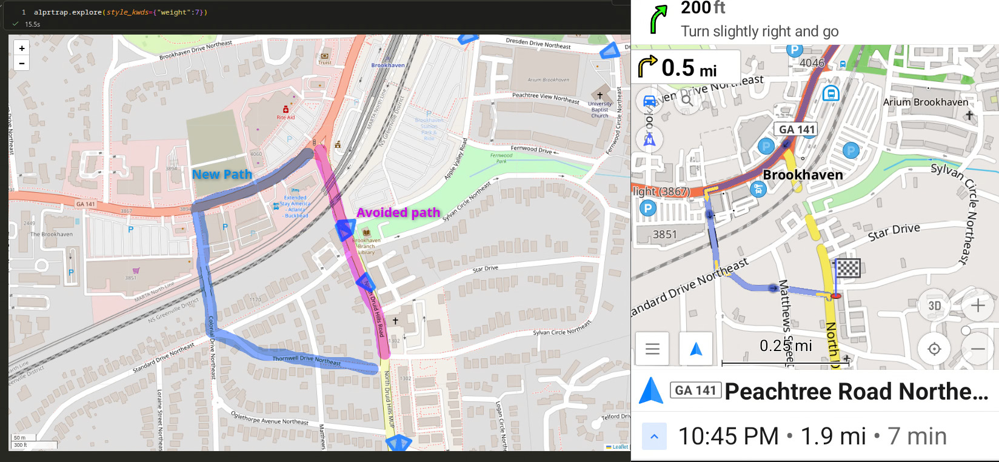
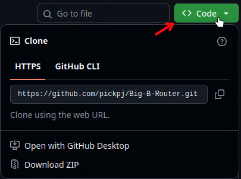
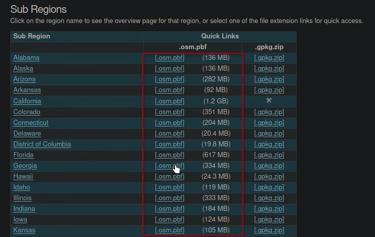
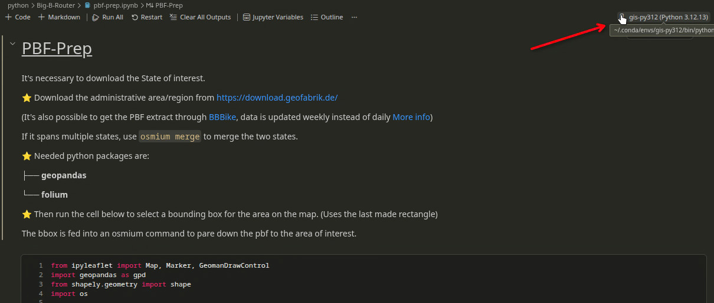
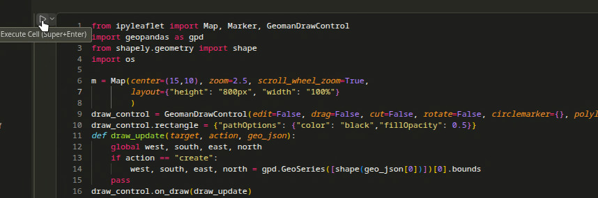
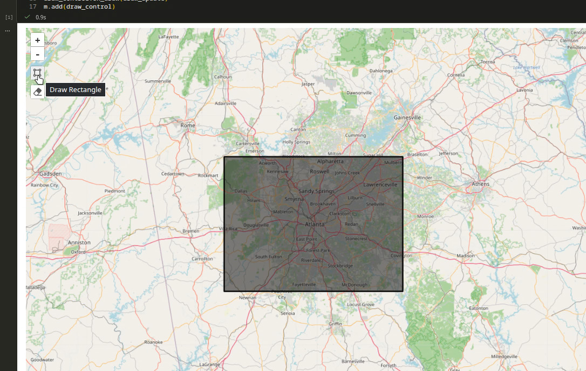
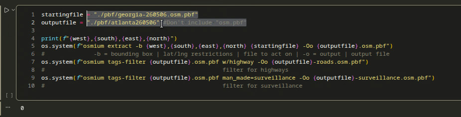
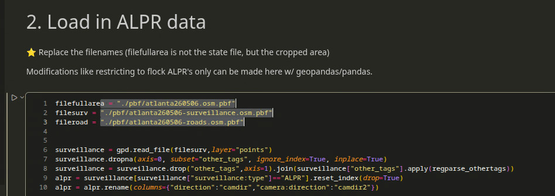
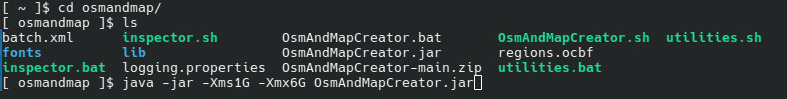
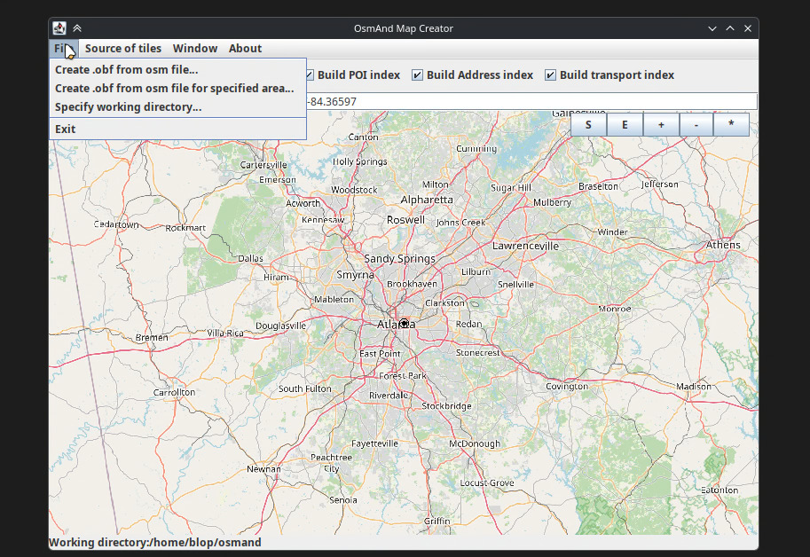

A (step by step) guide to [Big B-router](https://github.com/pickpj/Big-B-Router)  

---    
  
  
  
---  

Prereqs:  
1. Conda to manage python environment, I used [miniconda3, AUR link](https://aur.archlinux.org/packages/miniconda3)  
2. Some IDE to run python notebooks (using said conda env), I used vscodium with jupyter and jupyter notebook renderer extensions  
3. Java to run osmandmapcreator.jar  
4?. Osmium tool should work through conda, if not you may have to manually run the commands in pbf-prep  , [AUR link](https://aur.archlinux.org/packages/osmium-tool),   [conda-forge](https://anaconda.org/channels/conda-forge/packages/osmium-tool/overview)  
  
---  

We start by creating the python environment, under the name `gis-py312`  

`conda create -n gis-py312 -c conda-forge geopandas folium pyrosm pyosmium notebook ipyleaflet osmium-tool`  
  
 
::: {.callout-note collapse="true"}  
## Full package list:  
<pre>
  _openmp_mutex      conda-forge/linux-64::_openmp_mutex-4.5-20_gnu  
  _python_abi3_supp~ conda-forge/noarch::_python_abi3_support-1.0-hd8ed1ab_2  
  anyio              conda-forge/noarch::anyio-4.13.0-pyhcf101f3_0  
  argon2-cffi        conda-forge/noarch::argon2-cffi-25.1.0-pyhd8ed1ab_0  
  argon2-cffi-bindi~ conda-forge/linux-64::argon2-cffi-bindings-25.1.0-py312h4c3975b_2   
  arrow              conda-forge/noarch::arrow-1.4.0-pyhcf101f3_0   
  asttokens          conda-forge/noarch::asttokens-3.0.1-pyhd8ed1ab_0   
  async-lru          conda-forge/noarch::async-lru-2.3.0-pyhcf101f3_0   
  attrs              conda-forge/noarch::attrs-26.1.0-pyhcf101f3_0   
  babel              conda-forge/noarch::babel-2.18.0-pyhcf101f3_1   
  backports.zstd     conda-forge/linux-64::backports.zstd-1.4.0-py312h90b7ffd_0   
  beautifulsoup4     conda-forge/noarch::beautifulsoup4-4.14.3-pyha770c72_0   
  bleach             conda-forge/noarch::bleach-6.3.0-pyhcf101f3_1   
  bleach-with-css    conda-forge/noarch::bleach-with-css-6.3.0-hbca2aae_1   
  blosc              conda-forge/linux-64::blosc-1.21.6-he440d0b_1   
  branca             conda-forge/noarch::branca-0.8.2-pyhd8ed1ab_0   
  brotli             conda-forge/linux-64::brotli-1.2.0-hed03a55_1   
  brotli-bin         conda-forge/linux-64::brotli-bin-1.2.0-hb03c661_1   
  brotli-python      conda-forge/linux-64::brotli-python-1.2.0-py312hdb49522_1   
  bzip2              conda-forge/linux-64::bzip2-1.0.8-hda65f42_9   
  c-ares             conda-forge/linux-64::c-ares-1.34.6-hb03c661_0   
  ca-certificates    conda-forge/noarch::ca-certificates-2026.4.22-hbd8a1cb_0   
  cached-property    conda-forge/noarch::cached-property-1.5.2-hd8ed1ab_1   
  cached_property    conda-forge/noarch::cached_property-1.5.2-pyha770c72_1   
  certifi            conda-forge/noarch::certifi-2026.4.22-pyhd8ed1ab_0   
  cffi               conda-forge/linux-64::cffi-2.0.0-py312h460c074_1   
  charset-normalizer conda-forge/noarch::charset-normalizer-3.4.7-pyhd8ed1ab_0   
  comm               conda-forge/noarch::comm-0.2.3-pyhe01879c_0   
  contourpy          conda-forge/linux-64::contourpy-1.3.3-py312h0a2e395_4   
  cpython            conda-forge/noarch::cpython-3.12.13-py312hd8ed1ab_0   
  cycler             conda-forge/noarch::cycler-0.12.1-pyhcf101f3_2   
  cykhash            conda-forge/linux-64::cykhash-2.0.1-py312h1289d80_3   
  cython             conda-forge/linux-64::cython-3.2.4-py312h68e6be4_0   
  debugpy            conda-forge/linux-64::debugpy-1.8.20-py312h8285ef7_0   
  decorator          conda-forge/noarch::decorator-5.2.1-pyhd8ed1ab_0   
  defusedxml         conda-forge/noarch::defusedxml-0.7.1-pyhd8ed1ab_0   
  exceptiongroup     conda-forge/noarch::exceptiongroup-1.3.1-pyhd8ed1ab_0   
  executing          conda-forge/noarch::executing-2.2.1-pyhd8ed1ab_0   
  folium             conda-forge/noarch::folium-0.20.0-pyhd8ed1ab_0   
  fonttools          conda-forge/linux-64::fonttools-4.62.1-py312h8a5da7c_0   
  fqdn               conda-forge/noarch::fqdn-1.5.1-pyhd8ed1ab_1   
  freetype           conda-forge/linux-64::freetype-2.14.3-ha770c72_0   
  freexl             conda-forge/linux-64::freexl-2.0.0-h9dce30a_2   
  geopandas          conda-forge/noarch::geopandas-1.1.3-pyhd8ed1ab_0   
  geopandas-base     conda-forge/noarch::geopandas-base-1.1.3-pyha770c72_0   
  geos               conda-forge/linux-64::geos-3.14.1-h480dda7_0   
  giflib             conda-forge/linux-64::giflib-5.2.2-hd590300_0   
  h11                conda-forge/noarch::h11-0.16.0-pyhcf101f3_1   
  h2                 conda-forge/noarch::h2-4.3.0-pyhcf101f3_0   
  hpack              conda-forge/noarch::hpack-4.1.0-pyhd8ed1ab_0   
  httpcore           conda-forge/noarch::httpcore-1.0.9-pyh29332c3_0   
  httpx              conda-forge/noarch::httpx-0.28.1-pyhd8ed1ab_0   
  hyperframe         conda-forge/noarch::hyperframe-6.1.0-pyhd8ed1ab_0   
  icu                conda-forge/linux-64::icu-78.3-h33c6efd_0   
  idna               conda-forge/noarch::idna-3.13-pyhcf101f3_0   
  importlib-metadata conda-forge/noarch::importlib-metadata-8.8.0-pyhcf101f3_0   
  importlib_resourc~ conda-forge/noarch::importlib_resources-7.1.0-pyhd8ed1ab_0   
  ipykernel          conda-forge/noarch::ipykernel-7.2.0-pyha191276_1   
  ipyleaflet         conda-forge/noarch::ipyleaflet-0.20.0-pyhd8ed1ab_0   
  ipython            conda-forge/noarch::ipython-9.13.0-pyh53cf698_0   
  ipython_pygments_~ conda-forge/noarch::ipython_pygments_lexers-1.1.1-pyhd8ed1ab_0   
  ipywidgets         conda-forge/noarch::ipywidgets-8.1.8-pyhd8ed1ab_0   
  isoduration        conda-forge/noarch::isoduration-20.11.0-pyhd8ed1ab_1   
  jedi               conda-forge/noarch::jedi-0.19.2-pyhd8ed1ab_1   
  jinja2             conda-forge/noarch::jinja2-3.1.6-pyhcf101f3_1   
  joblib             conda-forge/noarch::joblib-1.5.3-pyhd8ed1ab_0   
  json-c             conda-forge/linux-64::json-c-0.18-h6688a6e_0   
  json5              conda-forge/noarch::json5-0.14.0-pyhd8ed1ab_0   
  jsonpointer        conda-forge/noarch::jsonpointer-3.1.1-pyhcf101f3_0   
  jsonschema         conda-forge/noarch::jsonschema-4.26.0-pyhcf101f3_0   
  jsonschema-specif~ conda-forge/noarch::jsonschema-specifications-2025.9.1-pyhcf101f3_0   
  jsonschema-with-f~ conda-forge/noarch::jsonschema-with-format-nongpl-4.26.0-hcf101f3_0   
  jupyter-lsp        conda-forge/noarch::jupyter-lsp-2.3.1-pyhcf101f3_0   
  jupyter_client     conda-forge/noarch::jupyter_client-8.8.0-pyhcf101f3_0   
  jupyter_core       conda-forge/noarch::jupyter_core-5.9.1-pyhc90fa1f_0   
  jupyter_events     conda-forge/noarch::jupyter_events-0.12.1-pyhcf101f3_0   
  jupyter_leaflet    conda-forge/noarch::jupyter_leaflet-0.20.0-pyhd8ed1ab_0   
  jupyter_server     conda-forge/noarch::jupyter_server-2.18.2-pyhcf101f3_0   
  jupyter_server_te~ conda-forge/noarch::jupyter_server_terminals-0.5.4-pyhcf101f3_0   
  jupyterlab         conda-forge/noarch::jupyterlab-4.5.7-pyhd8ed1ab_0   
  jupyterlab_pygmen~ conda-forge/noarch::jupyterlab_pygments-0.3.0-pyhd8ed1ab_2   
  jupyterlab_server  conda-forge/noarch::jupyterlab_server-2.28.0-pyhcf101f3_0   
  jupyterlab_widgets conda-forge/noarch::jupyterlab_widgets-3.0.16-pyhcf101f3_1   
  keyutils           conda-forge/linux-64::keyutils-1.6.3-hb9d3cd8_0   
  kiwisolver         conda-forge/linux-64::kiwisolver-1.5.0-py312h0a2e395_0   
  krb5               conda-forge/linux-64::krb5-1.22.2-ha1258a1_0   
  lark               conda-forge/noarch::lark-1.3.1-pyhd8ed1ab_0   
  lcms2              conda-forge/linux-64::lcms2-2.19.1-h0c24ade_0   
  ld_impl_linux-64   conda-forge/linux-64::ld_impl_linux-64-2.45.1-default_hbd61a6d_102   
  lerc               conda-forge/linux-64::lerc-4.1.0-hdb68285_0   
  libarchive         conda-forge/linux-64::libarchive-3.8.7-gpl_hc2c16d8_100   
  libblas            conda-forge/linux-64::libblas-3.11.0-6_h4a7cf45_openblas   
  libbrotlicommon    conda-forge/linux-64::libbrotlicommon-1.2.0-hb03c661_1   
  libbrotlidec       conda-forge/linux-64::libbrotlidec-1.2.0-hb03c661_1   
  libbrotlienc       conda-forge/linux-64::libbrotlienc-1.2.0-hb03c661_1   
  libcblas           conda-forge/linux-64::libcblas-3.11.0-6_h0358290_openblas   
  libcurl            conda-forge/linux-64::libcurl-8.20.0-hcf29cc6_0   
  libdeflate         conda-forge/linux-64::libdeflate-1.25-h17f619e_0   
  libedit            conda-forge/linux-64::libedit-3.1.20250104-pl5321h7949ede_0   
  libev              conda-forge/linux-64::libev-4.33-hd590300_2   
  libexpat           conda-forge/linux-64::libexpat-2.8.0-hecca717_0   
  libffi             conda-forge/linux-64::libffi-3.5.2-h3435931_0   
  libfreetype        conda-forge/linux-64::libfreetype-2.14.3-ha770c72_0   
  libfreetype6       conda-forge/linux-64::libfreetype6-2.14.3-h73754d4_0   
  libgcc             conda-forge/linux-64::libgcc-15.2.0-he0feb66_19   
  libgcc-ng          conda-forge/linux-64::libgcc-ng-15.2.0-h69a702a_19   
  libgdal-core       conda-forge/linux-64::libgdal-core-3.13.0-h08c5dba_0   
  libgfortran        conda-forge/linux-64::libgfortran-15.2.0-h69a702a_19   
  libgfortran5       conda-forge/linux-64::libgfortran5-15.2.0-h68bc16d_19   
  libgomp            conda-forge/linux-64::libgomp-15.2.0-he0feb66_19   
  libhwy             conda-forge/linux-64::libhwy-1.4.0-h10be129_0   
  libiconv           conda-forge/linux-64::libiconv-1.18-h3b78370_2   
  libjpeg-turbo      conda-forge/linux-64::libjpeg-turbo-3.1.4.1-hb03c661_0   
  libjxl             conda-forge/linux-64::libjxl-0.11.2-h174a0a3_1   
  libkml             conda-forge/linux-64::libkml-1.3.0-haa4a5bd_1023   
  liblapack          conda-forge/linux-64::liblapack-3.11.0-6_h47877c9_openblas   
  liblzma            conda-forge/linux-64::liblzma-5.8.3-hb03c661_0   
  libnghttp2         conda-forge/linux-64::libnghttp2-1.68.1-h877daf1_0   
  libnsl             conda-forge/linux-64::libnsl-2.0.1-hb9d3cd8_1   
  libopenblas        conda-forge/linux-64::libopenblas-0.3.32-pthreads_h94d23a6_0   
  libpng             conda-forge/linux-64::libpng-1.6.58-h421ea60_0   
  librttopo          conda-forge/linux-64::librttopo-1.1.0-h46dd2a8_20   
  libsodium          conda-forge/linux-64::libsodium-1.0.21-h280c20c_3   
  libspatialite      conda-forge/linux-64::libspatialite-5.1.0-gpl_hab3fe16_120   
  libsqlite          conda-forge/linux-64::libsqlite-3.53.1-h0c1763c_0   
  libssh2            conda-forge/linux-64::libssh2-1.11.1-hcf80075_0   
  libstdcxx          conda-forge/linux-64::libstdcxx-15.2.0-h934c35e_19   
  libstdcxx-ng       conda-forge/linux-64::libstdcxx-ng-15.2.0-hdf11a46_19   
  libtiff            conda-forge/linux-64::libtiff-4.7.1-h9d88235_1   
  libuuid            conda-forge/linux-64::libuuid-2.42-h5347b49_0   
  libwebp-base       conda-forge/linux-64::libwebp-base-1.6.0-hd42ef1d_0   
  libxcb             conda-forge/linux-64::libxcb-1.17.0-h8a09558_0   
  libxcrypt          conda-forge/linux-64::libxcrypt-4.4.36-hd590300_1   
  libxml2            conda-forge/linux-64::libxml2-2.15.3-h49c6c72_0   
  libxml2-16         conda-forge/linux-64::libxml2-16-2.15.3-hca6bf5a_0   
  libxml2-devel      conda-forge/linux-64::libxml2-devel-2.15.3-h49c6c72_0   
  libzlib            conda-forge/linux-64::libzlib-1.3.2-h25fd6f3_2   
  lz4-c              conda-forge/linux-64::lz4-c-1.10.0-h5888daf_1   
  lzo                conda-forge/linux-64::lzo-2.10-h280c20c_1002   
  mapclassify        conda-forge/noarch::mapclassify-2.10.0-pyhd8ed1ab_1   
  markupsafe         conda-forge/linux-64::markupsafe-3.0.3-py312h8a5da7c_1   
  matplotlib-base    conda-forge/linux-64::matplotlib-base-3.10.9-py312he3d6523_0   
  matplotlib-inline  conda-forge/noarch::matplotlib-inline-0.2.2-pyhd8ed1ab_0   
  minizip            conda-forge/linux-64::minizip-4.2.1-hb71707f_0   
  mistune            conda-forge/noarch::mistune-3.2.1-pyhcf101f3_0   
  munkres            conda-forge/noarch::munkres-1.1.4-pyhd8ed1ab_1   
  muparser           conda-forge/linux-64::muparser-2.3.5-h5888daf_0   
  nbclient           conda-forge/noarch::nbclient-0.10.4-pyhd8ed1ab_0   
  nbconvert-core     conda-forge/noarch::nbconvert-core-7.17.1-pyhcf101f3_0   
  nbformat           conda-forge/noarch::nbformat-5.10.4-pyhd8ed1ab_1   
  ncurses            conda-forge/linux-64::ncurses-6.6-hdb14827_0   
  nest-asyncio       conda-forge/noarch::nest-asyncio-1.6.0-pyhd8ed1ab_1   
  networkx           conda-forge/noarch::networkx-3.6.1-pyhcf101f3_0   
  notebook           conda-forge/noarch::notebook-7.5.6-pyhcf101f3_1   
  notebook-shim      conda-forge/noarch::notebook-shim-0.2.4-pyhd8ed1ab_1   
  numpy              conda-forge/linux-64::numpy-2.4.3-py312h33ff503_0   
  openjpeg           conda-forge/linux-64::openjpeg-2.5.4-h55fea9a_0   
  openssl            conda-forge/linux-64::openssl-3.6.2-h35e630c_0   
  overrides          conda-forge/noarch::overrides-7.7.0-pyhd8ed1ab_1   
  packaging          conda-forge/noarch::packaging-26.2-pyhc364b38_0   
  pandas             conda-forge/linux-64::pandas-3.0.2-py312h8ecdadd_0   
  pandocfilters      conda-forge/noarch::pandocfilters-1.5.0-pyhd8ed1ab_0   
  parso              conda-forge/noarch::parso-0.8.7-pyhcf101f3_0   
  pcre2              conda-forge/linux-64::pcre2-10.47-haa7fec5_0   
  pexpect            conda-forge/noarch::pexpect-4.9.0-pyhd8ed1ab_1   
  pillow             conda-forge/linux-64::pillow-12.2.0-py312h50c33e8_0   
  platformdirs       conda-forge/noarch::platformdirs-4.9.6-pyhcf101f3_0   
  proj               conda-forge/linux-64::proj-9.8.1-he0df7b0_0   
  prometheus_client  conda-forge/noarch::prometheus_client-0.25.0-pyhd8ed1ab_0   
  prompt-toolkit     conda-forge/noarch::prompt-toolkit-3.0.52-pyha770c72_0   
  psutil             conda-forge/linux-64::psutil-7.2.2-py312h5253ce2_0   
  pthread-stubs      conda-forge/linux-64::pthread-stubs-0.4-hb9d3cd8_1002   
  ptyprocess         conda-forge/noarch::ptyprocess-0.7.0-pyhd8ed1ab_1   
  pure_eval          conda-forge/noarch::pure_eval-0.2.3-pyhd8ed1ab_1   
  pycparser          conda-forge/noarch::pycparser-2.22-pyh29332c3_1   
  pygments           conda-forge/noarch::pygments-2.20.0-pyhd8ed1ab_0   
  pyogrio            conda-forge/linux-64::pyogrio-0.12.1-py312hdb6ebaa_1   
  pyosmium           conda-forge/linux-64::pyosmium-4.3.1-py312hb5eef74_0   
  pyparsing          conda-forge/noarch::pyparsing-3.3.2-pyhcf101f3_0   
  pyproj             conda-forge/linux-64::pyproj-3.7.2-py312hbc8341d_4   
  pyrobuf            conda-forge/linux-64::pyrobuf-0.9.3-py312h1289d80_8   
  pyrosm             conda-forge/linux-64::pyrosm-0.6.2-py312h30efb56_1   
  pysocks            conda-forge/noarch::pysocks-1.7.1-pyha55dd90_7   
  python             conda-forge/linux-64::python-3.12.13-hd63d673_0_cpython   
  python-dateutil    conda-forge/noarch::python-dateutil-2.9.0.post0-pyhe01879c_2   
  python-fastjsonsc~ conda-forge/noarch::python-fastjsonschema-2.21.2-pyhe01879c_0   
  python-gil         conda-forge/noarch::python-gil-3.12.13-hd8ed1ab_0   
  python-json-logger conda-forge/noarch::python-json-logger-3.2.1-pyh332efcf_0   
  python-rapidjson   conda-forge/linux-64::python-rapidjson-1.23-py312h1289d80_1   
  python-tzdata      conda-forge/noarch::python-tzdata-2026.2-pyhd8ed1ab_0   
  python_abi         conda-forge/noarch::python_abi-3.12-8_cp312   
  pyyaml             conda-forge/linux-64::pyyaml-6.0.3-py312h8a5da7c_1   
  pyzmq              conda-forge/linux-64::pyzmq-27.1.0-py312hda471dd_2   
  qhull              conda-forge/linux-64::qhull-2020.2-h434a139_5   
  readline           conda-forge/linux-64::readline-8.3-h853b02a_0   
  referencing        conda-forge/noarch::referencing-0.37.0-pyhcf101f3_0   
  requests           conda-forge/noarch::requests-2.33.1-pyhcf101f3_1   
  rfc3339-validator  conda-forge/noarch::rfc3339-validator-0.1.4-pyhd8ed1ab_1   
  rfc3986-validator  conda-forge/noarch::rfc3986-validator-0.1.1-pyh9f0ad1d_0   
  rfc3987-syntax     conda-forge/noarch::rfc3987-syntax-1.1.0-pyhe01879c_1   
  rpds-py            conda-forge/linux-64::rpds-py-0.30.0-py312h868fb18_0   
  scikit-learn       conda-forge/linux-64::scikit-learn-1.8.0-np2py312h3226591_1   
  scipy              conda-forge/linux-64::scipy-1.17.1-py312h54fa4ab_0   
  send2trash         conda-forge/noarch::send2trash-2.1.0-pyha191276_1   
  setuptools         conda-forge/noarch::setuptools-82.0.1-pyh332efcf_0   
  shapely            conda-forge/linux-64::shapely-2.1.2-py312h383787d_2   
  six                conda-forge/noarch::six-1.17.0-pyhe01879c_1   
  snappy             conda-forge/linux-64::snappy-1.2.2-h03e3b7b_1   
  sniffio            conda-forge/noarch::sniffio-1.3.1-pyhd8ed1ab_2   
  soupsieve          conda-forge/noarch::soupsieve-2.8.3-pyhd8ed1ab_0   
  sqlite             conda-forge/linux-64::sqlite-3.53.1-hbc0de68_0   
  stack_data         conda-forge/noarch::stack_data-0.6.3-pyhd8ed1ab_1   
  terminado          conda-forge/noarch::terminado-0.18.1-pyhc90fa1f_1   
  threadpoolctl      conda-forge/noarch::threadpoolctl-3.6.0-pyhecae5ae_0   
  tinycss2           conda-forge/noarch::tinycss2-1.4.0-pyhd8ed1ab_0   
  tk                 conda-forge/linux-64::tk-8.6.13-noxft_h366c992_103   
  tomli              conda-forge/noarch::tomli-2.4.1-pyhcf101f3_0   
  tornado            conda-forge/linux-64::tornado-6.5.5-py312h4c3975b_0   
  traitlets          conda-forge/noarch::traitlets-5.15.0-pyhcf101f3_0   
  traittypes         conda-forge/noarch::traittypes-0.2.3-pyh332efcf_0   
  typing-extensions  conda-forge/noarch::typing-extensions-4.15.0-h396c80c_0   
  typing_extensions  conda-forge/noarch::typing_extensions-4.15.0-pyhcf101f3_0   
  typing_utils       conda-forge/noarch::typing_utils-0.1.0-pyhd8ed1ab_1   
  tzdata             conda-forge/noarch::tzdata-2025c-hc9c84f9_1   
  unicodedata2       conda-forge/linux-64::unicodedata2-17.0.1-py312h4c3975b_0   
  uri-template       conda-forge/noarch::uri-template-1.3.0-pyhd8ed1ab_1   
  uriparser          conda-forge/linux-64::uriparser-0.9.8-hac33072_0   
  urllib3            conda-forge/noarch::urllib3-2.7.0-pyhd8ed1ab_0   
  wcwidth            conda-forge/noarch::wcwidth-0.7.0-pyhd8ed1ab_0   
  webcolors          conda-forge/noarch::webcolors-25.10.0-pyhd8ed1ab_0   
  webencodings       conda-forge/noarch::webencodings-0.5.1-pyhd8ed1ab_3   
  websocket-client   conda-forge/noarch::websocket-client-1.9.0-pyhd8ed1ab_0   
  widgetsnbextension conda-forge/noarch::widgetsnbextension-4.0.15-pyhd8ed1ab_0   
  xerces-c           conda-forge/linux-64::xerces-c-3.3.0-hd9031aa_1   
  xorg-libxau        conda-forge/linux-64::xorg-libxau-1.0.12-hb03c661_1   
  xorg-libxdmcp      conda-forge/linux-64::xorg-libxdmcp-1.1.5-hb03c661_1   
  xyzservices        conda-forge/noarch::xyzservices-2026.3.0-pyhd8ed1ab_0   
  yaml               conda-forge/linux-64::yaml-0.2.5-h280c20c_3   
  zeromq             conda-forge/linux-64::zeromq-4.3.5-h41580af_10   
  zipp               conda-forge/noarch::zipp-3.23.1-pyhcf101f3_0   
  zlib               conda-forge/linux-64::zlib-1.3.2-h25fd6f3_2   
  zlib-ng            conda-forge/linux-64::zlib-ng-2.3.3-hceb46e0_1   
  zstd               conda-forge/linux-64::zstd-1.5.7-hb78ec9c_6   
</pre>  
:::  
  
Clone or unzip the files from [github](https://github.com/pickpj/Big-B-Router)  

  

Download the osm.pbf file for your state through [geofabrik.de](https://download.geofabrik.de/north-america/us.html)  

  

Open the python notebook `pbf-prep.ipynb`, and set the kernel to the one we created `gis-py312`  

  

Run the first cell  

  

Select a bounding box around the area of interest  

::: {.callout-note collapse="true"}  
## Why:  
1. The map file expands a lot when loaded into memory. (Reducing is, practically, a necessity for large states like Texas or California)  
1a. Most of the memory usage comes from the road data and not the ALPRs  
1b. The road data represented 30% of the total file size for the Atlanta area in the example below.  
1c. For a 38MB road file, loading in the road data increased ram usage of vscodium from ~1.5GB to ~4.5GB   
2. Converting from pbf to obf is slower for large files.  
:::  

  

Adjust `startingfile` to point to the file you downloaded from geofabrike.de  
rename `outputfile` if you want  
and run the cell  

   

Open the python notebook `big-b-router.ipynb`  
Run the first cell to import libraries and define functions  
Edit the filenames to match what was created with pbf-prep.ipynb  
Run the second cell to load in the ALPR data  

Run the third cell to create the projection of the ALPRs    

::: {.callout-note collapse="true"}  
## Projection variables:  
<pre>
\‾‾‾|‾‾‾/  
|\  |  /|  
| \_|_/ |    _|_ is the angle  
|__\|/__|    __ __ is the base width (m)  
  
|                                 /
| in the middle is the direction /  is the vis range (m)
</pre>
:::

Run the fourth cell to load in the road data  
This uses quite a bit of ram. A 38MB road file would increase ram by about 4GB  
Run the fifth cell to determine which ID's to drop/edit  

Adjust the output filename, if desired  
Run the last cell to generate the new pbf file  

  

Now we transition to [osmandmapcreator](https://wiki.openstreetmap.org/wiki/OsmAndMapCreator). [dl link](https://download.osmand.net/latest-night-build/OsmAndMapCreator-main.zip)  
Download, unzip, and navigate to the folder containing `OsmAndMapCreator.jar`    
Run `java -jar -Xms1G -Xmx6G OsmAndMapCreator.jar`  
The -Xmx6G sets the maximum RAM amount to 6GB (it will use more RAM than needed if you set this too high)  
6GB should be enough for most use cases  

  

  

The file will be output to the "specified working directory"  
Which is likely `~/osmand/`  
Select the output file from big-b-router.ipynb and wait for it to process (takes a while)  
  

Once complete move/copy the .obf file to your phone  

Within the osmand app import the obf file and you now have offline anti-ALPR routing.  

  
    

  
---
  
Benefits of using Osmand:  
 - cross platform (ios & android)  
 - android auto/carplay (in the paid version)  
 - course correction/re-routing  
 - turn-by-turn directions  
 - deep ui customization  
 - routing customization  
 - plugins  
 - privacy respecting (downloadable from F-droid)  
 - open source!  
  
Downsides of Osmand:  
 - lack of traffic data (not compatible with privacy respecting)  
 - too many customization options is intimidating  
  
---   
  
Check out the BC (Bad Cams) articles to see how to OSM data can be improved.  

