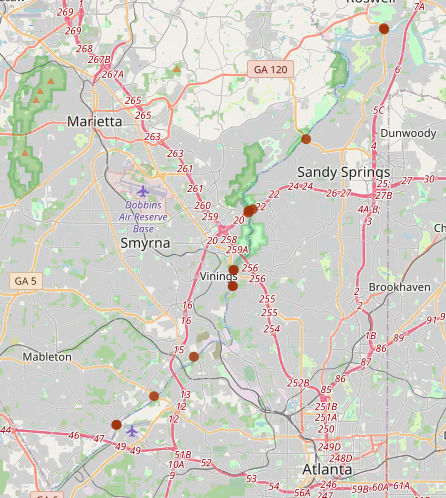

Going through ALPR data, I noticed how some ALPR cameras were not positioned in ***typical areas*** or near the intersection of roads. Rather, these  were installed at the intersection of roads and rivers. These bridges represent chokepoints in the road network that are unavoidable. This [wikipedia page](https://en.wikipedia.org/wiki/List_of_crossings_of_the_Lower_Mississippi_River) lists all the Mississippi river crossings from the Ohio river to the Gulf of Mexico. Notably, there are only 18 crossings over an area of ~800km / ~500miles (excluding ferries). Thus, observing all interstate traffic requires a trivial number of cameras. The same vulnerability exists on smaller rivers as well. There is also the aspect that rivers tend to delineate the municipal boundaries.  
  
Example:  
  

-----  

What are ***Typical areas***? (with overpass turbo queries):  
In vicinity of ramps of large roads  
`nwr[highway=primary_link]({{bbox}});`  
`nwr[highway=secondary_link]({{bbox}});`  
`nwr[highway=motorway_link]({{bbox}});`  
  
Hospitals  
`nwr[amenity=hospital]({{bbox}});`  
`nwr[healthcare=hospital]({{bbox}});`  
  
Parks  
`nwr[leisure=park]({{bbox}});`  
  
Shopping Malls  
`nwr[shop=mall]({{bbox}});`  
  
Sports Pitch   
`nwr[leisure=pitch]({{bbox}});`  
  
Warehouses  
Police Departments / Correctional Facility  
Lowes/Home Depot  
Higher density housing (HOA areas/new builds)  
  
----- 

The following ALPRs were detected within 100 meters of a bridge that crossed over a river.  
  
:::{.column-page-right}  
  
::: {.panel-tabset}  
## Map
```{python}
import pandas as pd
import geopandas as gpd
import folium
import itables
from datetime import datetime
from folium.plugins import MarkerCluster

m = folium.Map([35, -100], zoom_start=4)

bridgegdf = gpd.read_file("../../../osmetc/bridges.gpkg")
bridgegdf = bridgegdf.drop(["man_made", "river_waterway"], axis=1).rename({"alpr_osmid":"ALPR ID","alpr_highway":"ALPR highway","camdir":"Direction 1","camdir2":"Direction 2","road_osmid":"Road ID","road_name":"Road Name","road_highway":"Road Type","river_osmid":"River ID","river_name":"River Name"}, axis=1)

marker_cluster = MarkerCluster(disableClusteringAtZoom=10).add_to(m)

for idx, row in bridgegdf.iterrows():
    popup_html = f"<style> th\
                {{border:1px solid black;\}}</style>\
                <table><tr>\
                    <th>Road: </th>\
                    <th>{row['Road Name']}</th>\
                </tr><tr>\
                    <th>Road Type: </th>\
                    <th>{row['Road Type']}</th>\
                </tr><tr>\
                    <th>ALPR ID: </th>\
                    <th>{row['ALPR ID']}</th>\
                </tr><tr>\
                    <th>Road ID: </th>\
                    <th>{row['Road ID']}</th>\
                </tr><tr>\
                    <th>River ID: </th>\
                    <th>{row['River ID']}</th>\
                </tr><tr>\
                    <th text-align='center' colspan='2'><a href='https://www.openstreetmap.org/node/{row['ALPR ID']}' target='_blank'>https://www.openstreetmap.org/node/{row['ALPR ID']}</a></th>\
                </tr></table>"
    folium.Circle(
        location=[row.geometry.y, row.geometry.x], 
        popup=popup_html, fill=True, radius=20, weight=9,color="#9E2F02",opacity=0.8,fillOpacity=0.5
    ).add_to(marker_cluster)

m
```
## Table
```{python}
itables.show(pd.DataFrame(bridgegdf.drop(["geometry"], axis=1)), maxBytes=200000, allow_html=True)
```  
:::  

:::
Started with 1,502 datapoints on 2026-05-05.  
Last updated: `{python} datetime.today().strftime("%Y-%m-%d")`  

::: {.callout-note}  
## Road name is missing?  
Some bridges lack the "name" tag that is available in other bridges/roads. However, **YOU** can help correct the OpenStreetMap data by copying over the tag from the other segments of the road.
::: 
