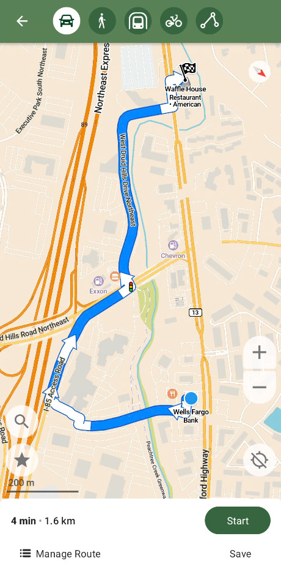

Editing and making custom (pbf file) maps that work with apps like osmand or comaps enables one to piggyback off the routing and more polished UI of these apps for any custom purpose. I initially figured out how to do this when trying to get ALPR avoidance routing. And the end result is remarkably polished.  

These steps assume that you already have a custom pbf file (ex: [big-b-router](https://github.com/pickpj/Big-B-Router/tree/comaps)). If you plan to make a custom pbf file I would recommend experimenting with osmandmapcreator first (#5 in the tradeoffs below).  

::: {.column-margin}
)](./comaps.jpeg)  
:::
Tradeoffs of Comaps mwm (An educated guess from my usage):

1. It doesn't seem like there is a way to do custom weighting, like with Osmand's routing.xml.  
2. Doesn't block or penalize paths that are gated.  
3. Seems to largely ignore information that is stored in nodes, outside of visualization.  
4. A toggleable feature would have to be encoded in the way? Like "toll=yes" for avoiding tolls.  
5. The conversion tool is more prone to failing/erroring (w/ custom objects) than osmandmapcreator  
6. Osmand routing is better at penalizing turns
    - ie. comaps routing might take several turns to get on and off a small road around an "obstruction" on a main road. The more optimal route would be with an earlier turn that might be "longer" or spend more time on a "slower road", but eliminates the time-consuming turns (particularly left turns).  

The process for converting and importing a custom pbf map into comaps is more "involved" (ie. complicated) than osmand. The advantage of comaps is android auto support without having to pay for the higher tier version of Osmand. But having been through it, I've documented the pitfalls to avoid.  

::: {.column-margin}
  
:::

### 1. Proper installation (building with the correct protobuf version)  
After cloning the [comaps repo](https://codeberg.org/comaps/comaps), you will probably want to nest the comaps directory in another folder as "build_omim" will create directories at the same level. Follow the [installmd](https://codeberg.org/comaps/comaps/src/branch/main/docs/INSTALL.md), particularly ensure you have the correct protobuf version prior to running "build_omim", outlined in [mapgen readme](https://codeberg.org/comaps/comaps/src/branch/release/2026.06.05/tools/python/maps_generator/README.md) (this could likely change with later updates but was the case ~2026-06). Or if you ran build_omim incorrectly you can use the "-c" option, you can check other options with "-h".  

### 2. map_generator.ini  
If you're using a local file, like I do, you will need to create an md5sum (md5sum mapfile.osm.pbf > mapfile.osm.pbf.md5) on top of setting the filepath. Make sure omim_path is correct.  

### 3. Edited PBF Properties  
The converter may complain if the pbf file is not sorted, use osmium sort.  
If you're editing and creating fake id's for ways/nodes make sure they're not consecutive as the converter will try to attach them (with comical results).  

### 4. Map generator parameters  
I used and would recommend parameters: `--skip="Coastline" --without_countries="World*"`  

### 5. Map File Path  
In the app settings set the map save location to Android/data/app.comaps/files.  
In the about&help of the app there is a date for the openstreetmap data. Create/use a directory with this date.  
Save the generated mwm files from the maps_build directory into the directory.  
Move the existing World.mwm and WorldCoasts.mwm to the same directory.  