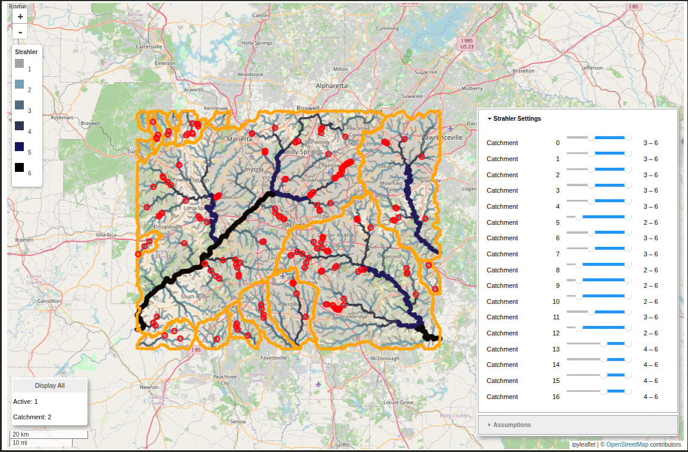

The initial goal was to simulate how a flood might affect the road network.  
I had seen others using satellite imagery of previous floods, but this seemed less relevant to the area I was observing. (<https://www.youtube.com/watch?v=LXi4s21vjAw>)  

Instead I processed DEM 10m tif data in QGIS. With a lot of RAM (used ~25GB for ATL area) and "DDM Hydrologic" in QGIS, we can generate flowpaths and cachements.  
Flooding is simulated by breaking roads that intersect with high enough strahler flowpaths. I made an ipyleaflet to interact with the data. There are settings to adjust parameters such as exclude certain built up infrastructure like as bridges/highways. [Code](https://github.com/pickpj/gis-extra)  
{width=70% .lightbox}  

Once the map is created, it is then converted to obf via osmandmapcreator. This finished map can be navigated to see how routing is impacted by the simulated "flooded" environment.  

